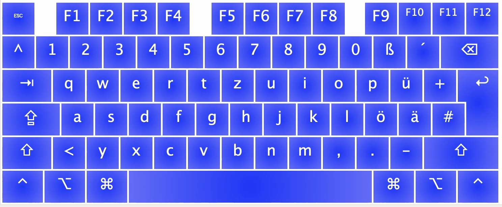
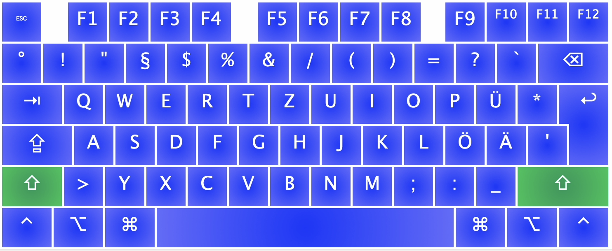
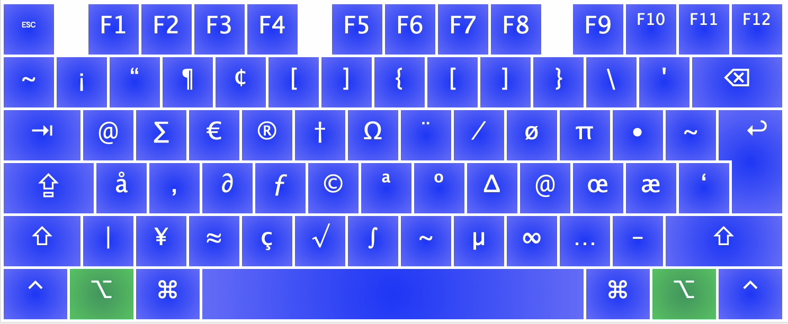

# macos-german-keyboard
A german keyboard layout that hopefully resembles a standard german keyboard layout enough to be usable







## A taste of AltGr

To remap the right command key to behave like another option key, so you get the illusion of AltGr in your life, create a file under `~/Library/LaunchAgents/com.local.KeyRemapping.plist` with the following contents:

```xml
<?xml version="1.0" encoding="UTF-8"?>
<!DOCTYPE plist PUBLIC "-//Apple//DTD PLIST 1.0//EN" "http://www.apple.com/DTDs/PropertyList-1.0.dtd">
<plist version="1.0">
<dict>
    <key>Label</key>
    <string>com.local.KeyRemapping</string>
    <key>ProgramArguments</key>
    <array>
        <string>/usr/bin/hidutil</string>
        <string>property</string>
        <string>--set</string>
        <string>{"UserKeyMapping":[
            {
              "HIDKeyboardModifierMappingSrc": 0x7000000E7,
              "HIDKeyboardModifierMappingDst": 0x7000000E6
            }
        ]}</string>
    </array>
    <key>RunAtLoad</key>
    <true/>
</dict>
</plist>
```

## Notable "features" to german users

If you remapped cmd to option and installed and selected the keyboard, you may enjoy the following features:

- `cmd q`   --->   `@`
- `cmd +`   --->   `~`
- `cmd 7`   --->   `{`
- `cmd 8`   --->   `[`
- `cmd 9`   --->   `]`
- `cmd 0`   --->   `}`
- `cmd ß`   --->   `\`
- `cmd ^`   --->   `~`
- `cmd <`   --->   `|`
